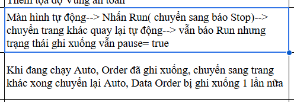

# Hướng dẫn Build & Cài đặt Gear Lathe Feeder Server

Thư mục `deploy/` chứa các script để **đóng gói** và **triển khai** hệ thống lên máy chủ sản xuất.

```
deploy/
├── build.ps1       # Build React + Publish .NET → dist/
├── setup.ps1       # Wizard cài đặt & cấu hình (Windows Service)
├── deploy.ps1      # Wrapper tổng hợp (gọi setup.ps1)
├── GUIDE.md        # File hướng dẫn này
└── Output/         # Output của Inno Setup (Desktop.App installer)
```

---

## Yêu cầu môi trường build

| Công cụ | Yêu cầu |
|---------|---------|
| .NET SDK | 10.0 trở lên |
| Node.js | 18 trở lên (có `npm`) |
| PowerShell | 5.1+ |

## Yêu cầu máy đích (Production)

| Thành phần | Ghi chú |
|-----------|---------|
| **SQL Server** | 2019+ hoặc SQL Server Express |
| **.NET Runtime** | 10.0+ (nếu dùng framework-dependent build) |

---

## Bước 1 – Build & Đóng gói

Chạy từ **thư mục gốc** của repository:

```powershell
# Build framework-dependent (cần .NET 10 trên máy đích)
.\deploy\build.ps1

# Build self-contained (không cần .NET trên máy đích)
.\deploy\build.ps1 -SelfContained -Runtime win-x64

# Chỉ định thư mục output
.\deploy\build.ps1 -OutputDir "C:\Release\GearLatheFeeder-v1.0"
```

Sau khi build xong, thư mục `dist/` sẽ có cấu trúc:

```
dist/
├── server/                     # .NET đã publish
│   ├── Server.Api.exe
│   ├── appsettings.json
│   └── wwwroot/                # React SPA (phục vụ bởi .NET)
│       ├── index.html
│       └── ...
├── deploy.ps1
├── setup.ps1
└── GUIDE.md
```

> **Giao diện web** được phục vụ trực tiếp bởi .NET trên cùng port với API – không cần Node.js trên máy sản xuất.

---

## Bước 2 – Cài đặt trên máy đích

Sao chép toàn bộ thư mục `dist/` lên máy đích. Mở **PowerShell với quyền Administrator**:

```powershell
cd C:\path\to\dist

# Chạy wizard cài đặt (khuyến nghị)
powershell -ExecutionPolicy Bypass -File deploy.ps1

# Hoặc chỉ chạy setup trực tiếp
powershell -ExecutionPolicy Bypass -File setup.ps1

# Cài vào thư mục tùy chỉnh
powershell -ExecutionPolicy Bypass -File deploy.ps1 -InstallDir D:\GearLatheFeeder
```

Wizard sẽ hỏi từng thông số:

```
── Server Settings ─────────────────────────────────────
  (Press Enter to keep current/default value)

  API Server Port [5000] :
  SQL Server Connection String [...] :
  Change JWT signing key (recommended for production)? [y/N] :

── Seed Accounts ─────────────────────────────────────────
  Admin Username [admin] :
  Admin Password [***] :
  Technician Username [technician] :
  Technician Password [***] :

── File Storage ──────────────────────────────────────────
  File Storage Root Path [Storage/Uploads] :
  File Storage Remote Path (optional) [] :

── Web Client ───────────────────────────────────────────
  Web API Base URL (auto|http://host:port) [auto] :
  Web App Name [Gear Lathe Feeder Pre-XLN] :

── Windows Service ───────────────────────────────────────
  Install 'GearLatheFeeder.Server' as a Windows Service? [Y/n] :
  Start 'GearLatheFeeder.Server' service now? [Y/n] :
```

Sau khi hoàn thành:
- Cấu hình ghi vào `server/appsettings.Production.json`
- Cấu hình web client ghi vào `server/wwwroot/config.json` (`API_BASE_URL`, `APP_NAME`)
- Service `GearLatheFeeder.Server` luôn được đặt chế độ **Automatic** (tự khởi động cùng hệ thống)
- Truy cập Web UI tại `http://<server-ip>:5000`

---

## Cấu hình thủ công

Mọi thông số lưu tại **`server/appsettings.Production.json`** (ghi đè `appsettings.json` built-in):

```json
{
  "Urls": "http://*:5000",
  "ConnectionStrings": {
    "DefaultConnection": "Server=127.0.0.1;Database=GearLatheFeederDb;User Id=sa;Password=...;TrustServerCertificate=True"
  },
  "Jwt": {
    "Issuer": "GearLatheFeeder.Server",
    "Audience": "GearLatheFeeder.Web",
    "SigningKey": "your-signing-key",
    "ExpirationMinutes": 480
  },
  "SeedData": {
    "AdminUsername": "admin",
    "AdminPassword": "Admin@123",
    "TechnicianUsername": "technician",
    "TechnicianPassword": "Technician@123"
  },
  "FileStorage": {
    "RootPath": "Storage/Uploads",
    "RemotePath": "\\\\SERVER\\Uploads"
  }
}
```

---

## Quản lý Service

```powershell
# Xem trạng thái
Get-Service GearLatheFeeder.Server

# Khởi động / Dừng / Khởi động lại
Start-Service   GearLatheFeeder.Server
Stop-Service    GearLatheFeeder.Server
Restart-Service GearLatheFeeder.Server

# Xem log (Event Viewer)
Get-EventLog -LogName Application -Source GearLatheFeeder.Server -Newest 50

# Gỡ cài đặt service
sc.exe delete GearLatheFeeder.Server
```

---

## Chạy thủ công (không dùng Service)

```powershell
cd dist\server
$env:ASPNETCORE_ENVIRONMENT = "Production"
.\Server.Api.exe
```

---

## Cập nhật phiên bản mới

1. Build lại gói mới bằng `build.ps1`
2. Dừng service trên máy đích
3. Sao chép đè thư mục `server/` mới (**giữ nguyên** `appsettings.Production.json`)
4. Khởi động lại service

```powershell
Stop-Service GearLatheFeeder.Server
Copy-Item .\dist\server\* -Destination "C:\GearLatheFeeder\server\" -Recurse -Force -Exclude appsettings.Production.json
Start-Service GearLatheFeeder.Server
```

---

## Cổng mặc định

| Cổng | Dịch vụ |
|------|---------|
| **5000** | Gear Lathe Feeder Server API + Web UI |
| 1433 | SQL Server |

---

## Desktop App (Inno Setup)

Để đóng gói ứng dụng Desktop (`Desktop.App`), dùng Inno Setup với script sẵn có:

```
deploy/ScriptSetupApp_UsingInno.iss
```

Build Desktop.App ở Release mode trước, sau đó compile file `.iss` bằng **Inno Setup Compiler**.
